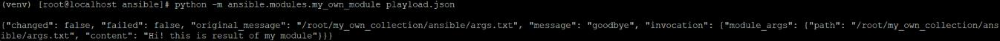
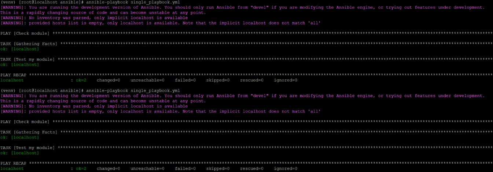
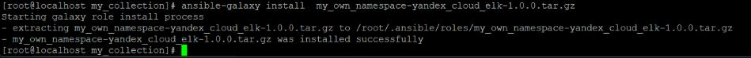
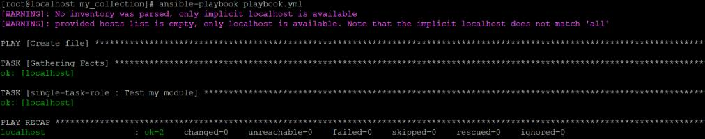

# Д/з занятие 6 «Создание собственных модулей»

Cсылки:
[collection](https://github.com/terseran/my_own_collection/)
[tar.gz](https://github.com/terseran/my_own_collection/blob/master/my_own_namespace-yandex_cloud_elk-1.0.0.tar.gz)

**4** 
```
python -m ansible.modules.my_own_module playload.json
```


**6**
```
ansible-playbook single_playbook.yml
```


**15**


**16**



